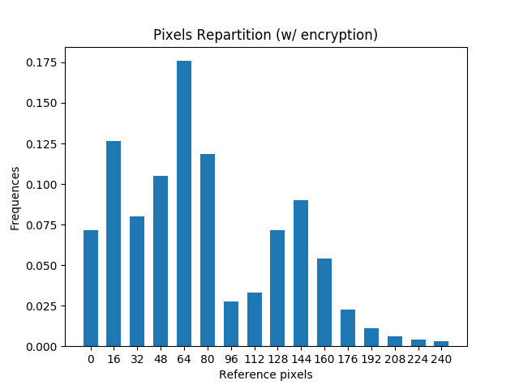

# **Content-Based Image Retrieval in Homomorphic Encryption Domain**
Joseph FACELINA \
HugoLudmann

## **Prerequisites**

In order to use the program, you need to install the following python libraries :
- gmpy2
- pillow
- tqdm

Pillow and tqdm can be installed with pip but for gmpy2 it's a bit more complicated since the version available on the packet manager has an issue with `random_state`.

To install gmpy2, clone the github repo (make sure to checkout the 2.0.9 branch) and follow the installation instruction. You'll need GMP beforehand.

## **Usage**

To use the program you need to feed it reference pixels and an image.

It comes with a help :
```sh
$ ./plot_histogram.py -h    
usage: SecHPlot [-h] -r REF_POINTS -i IMAGE [-j] [--unsecure]

Plot secured histogram of an image.

optional arguments:
  -h, --help            show this help message and exit
  -r REF_POINTS, --ref_points REF_POINTS
                        Filepath for the points of reference (json format).
  -i IMAGE, --image IMAGE
                        Filepath of the image to compute (json or png).
  -j, --json            Need this options if using a json for the image.
  --unsecure            To compute data without encryption.
```

The reference pixels need to be a list of `int`, to be simpler, we use json format to feed it to the program.

The "image" can be either a real image (PNG, JPEG...) or a matrix of pixels stored in json format. Furthermore, if the image is in color it will be converted into shades of grey before treatment.

At the end of the computation, the results are printed as a list of frequencies which each corresponds to the reference pixel of the same index; and the bar chart is displayed.

## **Example**

For instance, with the following reference pixels and image :

```py
[0, 16, 32, 48, 64, 80, 96, 112, 128, 144, 160, 176, 192, 208, 224, 240]
```


Running `./plot_histogram.py -r examples/ref.json -i examples/img_color.jpeg` gives these results :

```py
[0.07152808183735705, 0.1262986108347003, 0.0801456832384652, 0.1049038729451131, 0.17587469649326934, 0.1187358197667532, 0.027743501970306363, 0.03313696612665685, 0.07144847351032603, 0.08991760538152317, 0.053835131154715395, 0.022389841977471056, 0.011204872029614394, 0.0058910162002945915, 0.0039406121880348885, 0.0030052143454205415]
```


